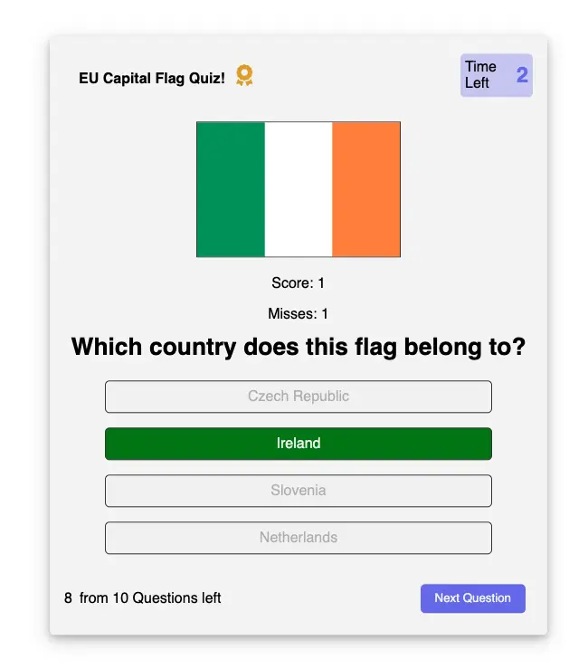
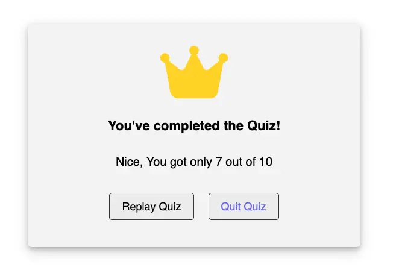

# European Union Flag Quiz

---

The Flag Quiz is a JavaScript application that allows users to test their knowledge of country flags. Users are presented with a flag and must select the correct country from multiple choices. The application tracks correct and incorrect answers and provides feedback on user performance.


## Contents

1. [Flag Quiz Website](#flag-quiz-website)
   - [User Story](#user-story)
   - [Acceptance Criteria](#acceptance-criteria)
2. [Features](#features)
   - [General Features on Each Page](#general-features-on-each-page)
   - [Future Implementations](#future-implementations)
   - [Accessibility](#accessibility)
3. [Usage](#usage)
4. [Design](#design)
   - [Color Scheme](#color-scheme)
   - [Typography](#typography)
   - [Wireframes](#wireframes)
5. [Technologies Used](#technologies-used)
6. [Deployment and Local Development](#deployment-and-local-development)
   - [Deployment](#deployment)
   - [Local Development](#local-development)
     - [How to Clone](#how-to-clone)
     - [Used Git Commands](#used-git-commands)
7. [Key Functionalities](#key-functionalities)
8. [Testing](#testing)
   - [Manual Testing](#manual-testing)
   - [HTML and CSS Validation](#html-and-css-validation)
   - [JavaScript Validation](#javascript-validation)
   - [Performance Testing with Lighthouse](#performance-testing-with-lighthouse)
   - [Accessibility Testing with Wave](#accessibility-testing-with-wave)
9. [Bugs](#bugs)
10. [Credits](#credits)
    - [Code Used](#code-used)
    - [Content](#content)
    - [Acknowledgements](#acknowledgements)

---

## Flag Quiz Website

[Live project here](https://mustafa-vienna.github.io/euro-capital-quiz-pp2/)

[Go to Contents](#contents)

## User Story

As a geography enthusiast, I want to test my knowledge of country flags by taking a quiz, so that I can improve my recognition skills and learn more about different countries.

### Acceptance Criteria

- As a user, I can see a flag and multiple choice options to select the correct country.
- I should be able to see my score and track my progress throughout the quiz.
- It's essential for me to have a timer for each question to make the quiz more challenging.
- The application should be responsive and work well on different devices.
- I expect the application to provide feedback on my performance after the quiz.

[Go to Contents](#contents)

## Features

### General Features on Each Page

- **Demo Data**: The application provides demo data for the first load for testing purposes.

- **Quiz Functionality**: Users are presented with a flag and must choose the correct country from four options.

  

- **Score Tracking**: Tracks the number of correct and incorrect answers.

- **Failed**: If the user scores less than 4 correct answers.
  

- **Pass**: If the user scores between 4 and 7 correct answers.
  

- **Excellent**: If the user scores more than 7 correct answers.
  

- **Timer**: Each question has a countdown timer to add urgency to the quiz. Each question must be answered within a 5-second time frame. If the player does not select any option within this time frame, they will lose one score.

  

- **Responsive Design**: The application is optimized for various screen sizes and devices.

### Future Implementations

I plan to enhance the Flag Quiz website with additional features such as more questions, difficulty levels, and leader boards to make the quiz more engaging and competitive.

### Accessibility

The Flag Quiz website is designed with accessibility in mind to ensure all users can navigate and enjoy the content. Key accessibility features include:

- **Responsive Design**: The site is fully responsive, adapting to different screen sizes and devices to provide a seamless experience for all users.
- **Alt Text for Images**: All images on the site include descriptive alt text to aid users with screen readers.
- **Keyboard Navigation**: The site supports full keyboard navigation to assist users who cannot use a mouse.
- **Contrast and Readability**: High contrast colors and readable fonts are used throughout the site to ensure text is easy to read.
- **Semantic HTML**: The site uses semantic HTML elements to improve accessibility and SEO.

[Go to Contents](#contents)

## Usage

1. Start the quiz by clicking the "Start" button.
2. View the flag displayed and choose the correct country from the multiple choice options.
3. The application will automatically move to the next question if the player did not select any answer and the timer runs out.
4. If the player selects an answer, they can click on the next button.
5. The next button is only clickable if the player made a choice.
6. After completing 10 questions, the quiz will end, and you will see your final score.
7. To restart the quiz, click the "Replay Quiz" button.
8. To quit/exit the quiz, click the "Quit Quiz" button.

[Go to Contents](#contents)

## Design

### Color Scheme

The color scheme for the Flag Quiz website was chosen to create a vibrant and engaging atmosphere that appeals to users of all ages. A smoke-white color was used for the background to enhance visibility and provide a comfortable viewing experience.


### Typography

The Flag Quiz website uses a combination of fonts to create a visually appealing and cohesive design. These fonts were chosen for their readability, versatility, and aesthetic appeal.

- **Roboto**: Imported from Google Fonts, used for both regular and bold text, in both normal and italic styles. Used for headings to add a playful and bold touch. Used for body text to ensure readability.

```
@import url('https://fonts.googleapis.com/css2?family=Roboto:ital,wght@0,400;0,700;1,400;1,700&display=swap');
```

- **Open Sans**: Used specifically for the rules in the .info-lis class to enhance readability and provide a clear presentation of information.

### Wireframes

#### Home

- Start Button


- Game Rules Box


- Quiz Box


- Result Box


[Go to Contents](#contents)

## Technologies Used

In the EU Capital Flag Quiz website, the following technologies and tools were used:

### Languages

- **HTML5**: Used for creating the structure and layout of the web application.
- **CSS3**: Used for styling and design, enhancing the visual appearance of the application.
- **JavaScript**: Used to implement the core functionality of the quiz application.

### Frameworks & Libraries

- **FontAwesome**: For including various icons.
- **Google Fonts**: For enhancing typography and design.
- **GitHub**: For version control and project management and as a backup for the project components.
- **Visual Studio Code**: As the primary code editor for development.
- **Google Font**: To enhance typography and design.
- **Google Developer Tools (Lighthouse)**: For performance, accessibility, best-practices, and SEO analysis.
- **FontAwesome**: For including various icons.
- **Favicon**: Too add a custom icon to the website.
- **Balsamiq**: For creating wire frames and planning the website layout.
- **Color.co**: For selecting and managing color schemes.
- **WebAIM.org**: For ensuring web accessibility standards.
- **Fotor.com**: For editing and optimizing images.
- **TinyPNG**: For compressing images to improve load times.
- **ui.dev/amiresponsive**: For testing the website's responsiveness on different devices.
- **Wave**: Forweb accessibility evaluation.
- **Developer.mozilla.org**: As a reference for web development standards and practices.
- **W3Schools.com**: For additional tutorials and resources.
- **Validator.w3.org**: For validating HTML code.
- **Jigsaw.w3.org**: For validating CSS code.

[Go to Contents](#contents)

## Deployment and Local Development

[Go to Contents](#contents)

### Deployment

To deploy this project, follow these steps:

1. **Create a New Repo**: Open GitHub and create a new repo.
2. **Push Your Code**: Push your local project code to the GitHub repo.
3. **GitHub Pages Configuration**: In the repository settings, navigate to the "GitHub Pages" section and select the main branch as the source for deployment.

### Local Development

To set up the project for local development, follow these steps:

#### How to Clone

1. **Log into Your GitHub Account**: Ensure you are logged into your GitHub account.
2. **Go to the Repo**: Navigate to the repo for this project.
3. **Copy the Clone Link**: Click on the "Code" button and copy your preferred clone link (HTTPS, SSH, or GitHub CLI).
4. **Open the Terminal**: Open the terminal in your code editor.
5. **Change Directory**: Change the current working directory to the location where you want the cloned directory to be created.
6. **Clone the Repo**: Type `git clone` in the terminal, paste the link you copied in step 3, and press Enter.

#### Used Git Commands

```bash
git add.
git status
git commit -m "Your commit massage"
git push
```

- `git add <file_name>`: Added specific files to the staging area before committing changes.
- `git add .`: To add all files to the staging area before committing changes.
- `git commit -m "commit message"`: Committed the staged changes with descriptive messages to track the progress of the project.
- `git push`: Pushed local commits to the remote repository on GitHub, ensuring that the latest changes were synchronized with the online repository.

[Go to Contents](#contents)

## Key Functionalities

- **Answer Validation**: The application checks if the selected answer is correct and updates the score accordingly.

- **Timer Functionality**: Each question has a countdown timer, and if the user does not select an answer in time, it increments the incorrect answer count and moves to the next question.

[Go to Contents](#contents)

## Testing

### Manual Testing

Manual testing was conducted to ensure that common elements functioned correctly and were responsive on different devices. The following checks were confirmed:

| Test Case                | Description                                                                                                                                                                                                                                                                                                                                                        | Status |
| ------------------------ | ------------------------------------------------------------------------------------------------------------------------------------------------------------------------------------------------------------------------------------------------------------------------------------------------------------------------------------------------------------------ | ------ |
| Start Button             | Verified that clicking the "Start" button navigates the user to the game rules box.                                                                                                                                                                                                                                                                                | Passed |
| Game Rules Box           | Ensured that the game rules are displayed correctly.                                                                                                                                                                                                                                                                                                               | Passed |
| Continue Button          | Verified that clicking the "Continue" button on the rules box navigates the user to the quiz game box.                                                                                                                                                                                                                                                             | Passed |
| Exit Quiz Button         | Ensured that clicking the "Exit Quiz" button on the rules box navigates the user back to the first page with the "Start" button.                                                                                                                                                                                                                                   | Passed |
| Flag Display             | Ensured that a flag image is displayed at the start of each question.                                                                                                                                                                                                                                                                                              | Passed |
| Answer Options           | Checked that four answer options are displayed for each question.                                                                                                                                                                                                                                                                                                  | Passed |
| Answer Selection         | Verified that selecting an answer highlights the selected option and enables the "Next" button.                                                                                                                                                                                                                                                                    | Passed |
| Correct Option           | Verified that one of the four options matches the displayed flag.                                                                                                                                                                                                                                                                                                  | Passed |
| Incorrect Answer         | Ensured that if the user answers incorrectly, the button background color turns red.                                                                                                                                                                                                                                                                               | Passed |
| Correct Answer           | Ensured that if the user answers correctly, the button background color turns green.                                                                                                                                                                                                                                                                               | Passed |
| Score Increment          | Verified that if the user answers correctly, the score counter increments by one.                                                                                                                                                                                                                                                                                  | Passed |
| Miss Increment           | Verified that if the user answers incorrectly, the miss counter increments by one.                                                                                                                                                                                                                                                                                 | Passed |
| Total Question Counter   | Confirmed that after the user answers (correct, incorrect, or timeout), the total question counter decrements by one.                                                                                                                                                                                                                                              | Passed |
| Timer Functionality      | Confirmed that the timer starts at the beginning of each question and counts down from 5 seconds.                                                                                                                                                                                                                                                                  | Passed |
| Timer Expiry             | Ensured that if no answer is selected within 5 seconds, the question is marked as incorrect, and the application moves to the next question.                                                                                                                                                                                                                       | Passed |
| Next Button              | Verified that the "Next" button becomes clickable only after an answer is selected and correctly navigates to the next question.                                                                                                                                                                                                                                   | Passed |
| Score Tracking           | Checked that the score is updated correctly for both correct and incorrect answers.                                                                                                                                                                                                                                                                                | Passed |
| End of Quiz              | Ensured that after 10 questions, the quiz ends and the final score is displayed.                                                                                                                                                                                                                                                                                   | Passed |
| Result Box Display       | Verified that the result box displays the text according to user scores.                                                                                                                                                                                                                                                                                           | Passed |
| Score Tracking           | Checked that the number of correct and incorrect answers are accurately displayed in the result box.                                                                                                                                                                                                                                                               | Passed |
| Result Messages          | Ensured that the result messages are displayed according to the following scenarios:<br> - If the user scores less than 4 correct answers, the message "Sorry" is displayed.<br> - If the user scores between 4 and 7 correct answers, the message "Nice" is displayed.<br> - If the user scores more than 7 correct answers, the message "Congrats" is displayed. | Passed |
| Result Box Functionality | Confirmed that the result box shows the appropriate message based on the user's score at the end of the quiz.                                                                                                                                                                                                                                                      | Passed |
| Responsive Result Box    | Ensured that the result box is responsive and displays correctly on different screen sizes, including desktops, tablets, and mobile devices.                                                                                                                                                                                                                       | Passed |

---

### 404 Page Testing

- **Implementation**: A custom 404 page has been added to the project to handle non-existent routes. This page provides users with a friendly message and a link to return to the home page.
- **Testing**: The 404 page was thoroughly tested to ensure it works as expected.

| Test Case                        | Description                                                                              | Status |
| -------------------------------- | ---------------------------------------------------------------------------------------- | ------ |
| Navigating to a non-existent URL | Verified that accessing a non-existent URL within the application displays the 404 page. | Passed |
| 404 Message Display              | Ensured that the 404 message is correctly displayed on the page.                         | Passed |
| Home Page Link                   | Verified that the link on the 404 page redirects users back to the home page.            | Passed |

- **Results**: All test cases passed successfully. The 404 page displays correctly when users navigate to an invalid URL, and the redirect link functions as intended.

The addition and testing of the 404 page ensures that users encounter a clear and helpful message when they try to access a page that does not exist, improving overall user experience.

### Following Devices were used for testing:

#### Browser

- Google Chrome
- safari

#### Laptop

- Macbook Air M1, 13-inch
- Samsung Monitor 32-inch
- Asus Zenbook Fold

#### Tablets

- Blackberry Playbook
- Nexus 10
- iPad Mini
- iPad Air
- iPad Pro
- Surface Pro 7

#### Mobile devices

- Google Pixel 6
- Galaxy Note 3
- Nexus 6P
- Nokia N9
- iPhone SE
- iPhone XR
- iPhone 12 Pro
- iPhone 14 Pro max
- iPhone 15 Pro max
- Pixel 7
- Samsung Galaxy Z Fold 4
- Samsung Galaxy S8+
- Samsung Galaxy S20
- Samsung Galaxy S20 Ultra
- Samsung Galaxy A51/71
- Surface Duo

[Go to Contents](#contents)

### HTML and CSS Validation

#### Jigsaw CSS Validator

The CSS code was validated using [Jigsaw W3 Validator](https://jigsaw.w3.org/css-validator/)


- **Pass**

#### W3 HTML Validator

The HTML code was validated using [W3C Validator](https://validator.w3.org/#validate_by_uri+with_options)


- **Pass**

#### JavaScript Validation

Each JavaScript function within the Bookmark Manager application was meticulously tested for errors and functionality using the browser console and [JSHint](https://jshint.com/) tool.

No errors were found and the following metrics were returned:

- **Pass**


- **Pass**

[Go to Contents](#contents)

## Performance Testing with Lighthouse

I use Lighthouse to test and improve my website's performance, accessibility, best practice, and SEO.

### Start page


### Game Rules page


### Quiz Game page


### Results page


[Go to Contents](#contents)

## Accessibility Testing with Wave

I use the Wave extension to test and improve website accessibility. It provides detailed insights and recommendations, making it easier to identify and fix accessibility issues, ensuring an inclusive user experience for all.

### Start page


### Game Rules page


### Quiz Game page


### Results page


[Go to Contents](#contents)

## Bugs

### Fix generating new game,scoring implementation.

- **Issue**: Previously, there were problems with starting a new game and correctly implementing the scoring system. Users experienced issues where the game would not reset properly, and scores were not being calculated or displayed accurately.

- **Solution**: The game initialization logic was revised to ensure that a new game starts correctly each time.

### Improve answer validation and split code into helper functions

- **Issue**: The answer validation process was not robust enough, leading to incorrect feedback for users. Additionally, the codebase was becoming difficult to manage and maintain due to the lack of modularization.
- **Solution**: Enhanced the answer validation logic to ensure precise and accurate feedback for users. The codebase was also refactored by splitting it into helper functions, improving readability, maintainability, and facilitating easier debugging and future enhancements.

There are no known and unfixed bugs.

[Go to Contents](#contents)

## Credits

### Code Used

- [MDN Web Docs](https://developer.mozilla.org/en-US/docs/Web/CSS/box-shadow): The `box-shadow` property example was learned from MDN Web Docs.

- [Stack Overflow](https://stackoverflow.com/questions/2450954/how-to-randomize-shuffle-a-javascript-array): The `shuffle` method using the Fisher-Yates algorithm was learned from Stack Overflow.

- [Stack Overflow](https://stackoverflow.com/questions/76184276/userscript-addeventlistener-seemingly-not-attaching-to-element): Remove eventListeners from answer buttons.
  

### Content

- This project is a JavaScript-based quiz game that tests users' knowledge of European Union flags. The primary goal of the project is to create an engaging and educational quiz experience. The quiz features a clean and intuitive user interface, randomization of questions, scoring, and responsive design.

[Go to Contents](#content)

### Acknowledgements

I would like to express my deepest gratitude to those who supported and guided me throughout this project:

#### Luke

My mentor, Luke, provided invaluable support and guidance from the initial concept to the final implementation. His expertise and advice were crucial in shaping the project. He suggested using the [Flagpedia API](https://flagpedia.net/download/api), which streamlined the process of generating EU flags, saving both time and effort. Luke's constant encouragement and constructive feedback kept me motivated and focused, significantly contributing to my growth as a developer. Thank you, Luke, for your unwavering support and mentorship.

#### Ioan

Special thanks to my friend and classmate, Ioan, for his extensive support throughout this project. His experience in development was invaluable, particularly in troubleshooting code issues and structuring JavaScript efficiently. Ioan's advice on time management was crucial for meeting deadlines and staying on track. Thank you, Ioan, for your patience, willingness to share your knowledge, and constant support.

#### API Usage

- [Flagpedia API](https://flagpedia.net/download/api) was utilized to generate the European Union flags, which significantly reduced development time. This resource was recommended by my mentor, Luke.

#### Learning Resources

I found the following Youtube channels very helpful in understanding the concepts of CSS, HTML and JavaScript:

- [GreatStack](https://www.youtube.com/watch?v=PBcqGxrr9g8&t=1213s): The quiz game structure was learned from the GreatStack YouTube channel.

- [Bro Code](https://www.youtube.com/watch?v=lfmg-EJ8gm4): Much of the JavaScript-related knowledge used in the project was learned from the Bro Code YouTube channel. The video is 12 hours long and provides deep explanations of JavaScript.

- [Dave Gray](https://www.youtube.com/watch?v=EfAl9bwzVZk&t=13465s): Very handy for beginners like me in JavaScript. The 8-hour long tutorial explains everything from zero to advanced concepts

- [JavaScript King](https://www.youtube.com/watch?v=NfvtQ2p5QG4&t=14530s): Includes 30 small projects mainly with JavaScript and some HTML and CSS. Very handy for planning and starting projects.

- [Flag Quiz](https://github.com/Natalitta/flags-quiz): Inspiration, structure, and guidance on how to start and end the quiz were learned from the Flag Quiz project on GitHub.

- **ChatGPT**: Used for understanding CSS code, troubleshooting, and improving my English writing skills, particularly for crafting the README file.

- [Brad Traversy - JavaScript: From Beginner to Advanced](https://www.udemy.com/course/modern-javascript-from-the-beginning/learn/lecture/37192762?start=60#overview/): This 36-hour course by Brad Traversy helped me build a strong foundation in JavaScript. I completed 50% of the course, covering essential topics such as basic syntax, functions, DOM manipulation, and asynchronous JavaScript. The knowledge gained from this course was crucial in developing this project.

---

[Go to Contents](#contents)
