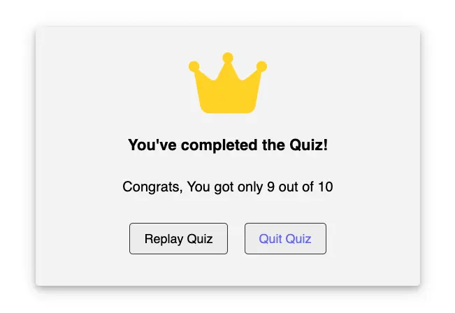

# European Union Flag Quiz

---

The Flag Quiz is a JavaScript application that allows users to test their knowledge of country flags. Users are presented with a flag and must select the correct country from multiple choices. The application tracks correct and incorrect answers and provides feedback on user performance.

[Live project here](https://mustafa-vienna.github.io/euro-capital-quiz-pp2/)


## Contents

1. [Flag Quiz Website](#flag-quiz-website)
   - [User Story](#user-story)
   - [Acceptance Criteria](#acceptance-criteria)
2. [Features](#features)
   - [General Features on Each Page](#general-features-on-each-page)
   - [Future Implementations](#future-implementations)
   - [Accessibility](#accessibility)
3. [Usage](#usage)
4. [Design](#design)
   - [Color Scheme](#color-scheme)
   - [Typography](#typography)
   - [Wireframes](#wireframes)
5. [Technologies Used](#technologies-used)
6. [Deployment & Local Development](#deployment-local-development)
   - [Deployment](#deployment)
   - [Local Development](#local-development)
     - [How to Clone](#how-to-clone)
     - [Used Git Commands](#used-git-commands)
7. [Key Functionalities](#key-functionalities)

## User Story

As a geography enthusiast, I want to test my knowledge of country flags by taking a quiz, so that I can improve my recognition skills and learn more about different countries.

### Acceptance Criteria

- As a user, I can see a flag and multiple choice options to select the correct country.
- I should be able to see my score and track my progress throughout the quiz.
- It's essential for me to have a timer for each question to make the quiz more challenging.
- The application should be responsive and work well on different devices.
- I expect the application to provide feedback on my performance after the quiz.

[Go to Contents](#contents)

## Features

### General Features on Each Page

- **Demo Data**: The application provides demo data for the first load for testing purposes.

- **Quiz Functionality**: Users are presented with a flag and must choose the correct country from four options.

  

- **Score Tracking**: Tracks the number of correct and incorrect answers.

- **Failed**: If the user scores less than 4 correct answers.
  

- **Pass**: If the user scores between 4 and 7 correct answers.
  

- **Excellent**: If the user scores more than 7 correct answers.
  

- **Timer**: Each question has a countdown timer to add urgency to the quiz. Each question must be answered within a 5-second time frame. If the player does not select any option within this time frame, they will lose one score.

  

- **Responsive Design**: The application is optimized for various screen sizes and devices.

### Future Implementations

I plan to enhance the Flag Quiz website with additional features such as more questions, difficulty levels, and leader boards to make the quiz more engaging and competitive.

### Accessibility

The Flag Quiz website is designed with accessibility in mind to ensure all users can navigate and enjoy the content. Key accessibility features include:

- **Responsive Design**: The site is fully responsive, adapting to different screen sizes and devices to provide a seamless experience for all users.
- **Alt Text for Images**: All images on the site include descriptive alt text to aid users with screen readers.
- **Keyboard Navigation**: The site supports full keyboard navigation to assist users who cannot use a mouse.
- **Contrast and Readability**: High contrast colors and readable fonts are used throughout the site to ensure text is easy to read.
- **Semantic HTML**: The site uses semantic HTML elements to improve accessibility and SEO.

[Go to Contents](#contents)

## Usage

1. Start the quiz by clicking the "Start" button.
2. View the flag displayed and choose the correct country from the multiple choice options.
3. The application will automatically move to the next question if the player did not select any answer and the timer runs out.
4. If the player selects an answer, they can click on the next button.
5. The next button is only clickable if the player made a choice.
6. After completing 10 questions, the quiz will end, and you will see your final score.
7. To restart the quiz, click the "Replay Quiz" button.
8. To quit/exit the quiz, click the "Quit Quiz" button.

[Go to Contents](#contents)

## Design

### Color Scheme

The color scheme for the Flag Quiz website was chosen to create a vibrant and engaging atmosphere that appeals to users of all ages. A smoke-white color was used for the background to enhance visibility and provide a comfortable viewing experience.


### Typography

The Flag Quiz website uses a combination of fonts to create a visually appealing and cohesive design. These fonts were chosen for their readability, versatility, and aesthetic appeal.

- **Roboto**: Imported from Google Fonts, used for both regular and bold text, in both normal and italic styles. Used for headings to add a playful and bold touch. Used for body text to ensure readability.

```
@import url('https://fonts.googleapis.com/css2?family=Roboto:ital,wght@0,400;0,700;1,400;1,700&display=swap');
```

- **Open Sans**: Used specifically for the rules in the .info-lis class to enhance readability and provide a clear presentation of information.

### Wireframes

#### Home

- Start Button


- Game Rules Box


- Quiz Box


- Result Box


[Go to Contents](#contents)

## Technologies Used

In the EU Capital Flag Quiz website, the following technologies and tools were used:

### Languages

- **HTML5**: Used for creating the structure and layout of the web application.
- **CSS3**: Used for styling and design, enhancing the visual appearance of the application.
- **JavaScript**: Used to implement the core functionality of the quiz application.

### Frameworks & Libraries

- **FontAwesome**: For including various icons.
- **Google Fonts**: For enhancing typography and design.
- **GitHub**: For version control and project management and as a backup for the project components.
- **Visual Studio Code**: As the primary code editor for development.
- **Google Font**: To enhance typography and design.
- **Google Developer Tools (Lighthouse)**: For performance, accessibility, best-practices, and SEO analysis.
- **FontAwesome**: For including various icons.
- **Favicon**: Too add a custom icon to the website.
- **Balsamiq**: For creating wire frames and planning the website layout.
- **Color.co**: For selecting and managing color schemes.
- **WebAIM.org**: For ensuring web accessibility standards.
- **Fotor.com**: For editing and optimizing images.
- **TinyPNG**: For compressing images to improve load times.
- **ui.dev/amiresponsive**: For testing the website's responsiveness on different devices.
- **Wave**: Forweb accessibility evaluation.
- **Developer.mozilla.org**: As a reference for web development standards and practices.
- **W3Schools.com**: For additional tutorials and resources.
- **Validator.w3.org**: For validating HTML code.
- **Jigsaw.w3.org**: For validating CSS code.

[Go to Contents](#contents)

## Deployment & Local Development

### Deployment

To deploy this project, follow these steps:

1. **Create a New Repo**: Open GitHub and create a new repo.
2. **Push Your Code**: Push your local project code to the GitHub repo.
3. **GitHub Pages Configuration**: In the repository settings, navigate to the "GitHub Pages" section and select the main branch as the source for deployment.

### Local Development

To set up the project for local development, follow these steps:

#### How to Clone

1. **Log into Your GitHub Account**: Ensure you are logged into your GitHub account.
2. **Go to the Repo**: Navigate to the repo for this project.
3. **Copy the Clone Link**: Click on the "Code" button and copy your preferred clone link (HTTPS, SSH, or GitHub CLI).
4. **Open the Terminal**: Open the terminal in your code editor.
5. **Change Directory**: Change the current working directory to the location where you want the cloned directory to be created.
6. **Clone the Repo**: Type `git clone` in the terminal, paste the link you copied in step 3, and press Enter.

#### Used Git Commands

```bash
git add.
git status
git commit -m "Your commit massage"
git push
```

[Go to Contents](#contents)

## Key Functionalities

- **Answer Validation**: The application checks if the selected answer is correct and updates the score accordingly.

- **Timer Functionality**: Each question has a countdown timer, and if the user does not select an answer in time, it increments the incorrect answer count and moves to the next question.

[Go to Contents](#contents)
